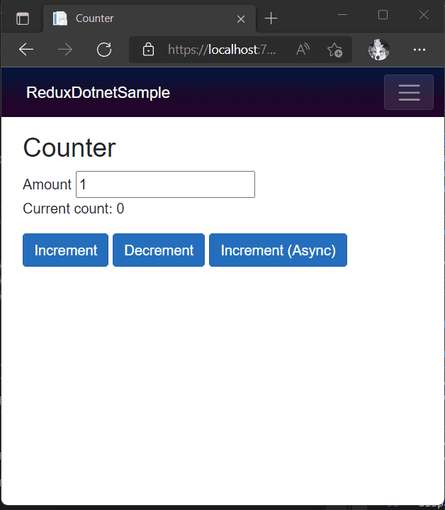

# ReduxDotnet

This is a just simple but enough implementation Redux for .NET 6.

https://www.nuget.org/packages/ReduxDotnet

## How to use this

Create state, actions, reducers and effects.

```csharp
// Define app state
record AppState(int Count);

// Define actions
record IncrementAction();
record DecrementAction();

// Define reducer
class Reducers :
    IReducer<AppState, IncrementAction>,
    IReducer<AppState, DecrementAction>
{
    public AppState Invoke(AppState store, IncrementAction action) => 
        store with { Count = store.Count + 1 };

    public AppState Invoke(AppState store, DecrementAction action) =>
        store with { Count = store.Count - 1 };
}

// Define effects (If you want to use async operation)
class Effects
{
    public EffectDelegate<AppState> IncrementLater() => async (d, _) =>
    {
        await Task.Delay(2000);
        d.Dispatch(new IncrementAction());
    };
}
```

Let's use those on your app. ReduxDotnet is designed work with `Microsoft.Extensions.DependencyInjection`.

```csharp
using Microsoft.Extensions.DependencyInjection;
using Reactive.Bindings;
using ReduxDotnet;

var services = new ServiceCollection();
// init ReduxDotnet with initial status
services.AddReduxDotnet<AppState>(new AppState(0));
// Add reducers and effects
services.AddReducer<Reducers>();
services.AddSingleton<Effects>();

var provider = services.BuildServiceProvider();

// AppStore is IReactiveProperty<AppState>.
var store = provider.GetRequiredService<IReactiveProperty<AppState>>();
store.Subscribe(x =>
    Console.WriteLine($"{DateTime.Now:yyyy-MM-dd HH:mm:ss}: Status was changed {x}."));

// Dispatcher and Effects
var dispatcher = provider.GetRequiredService<IDispatcher<AppState>>();
var effects = provider.GetRequiredService<Effects>();

// Dispatch actions
dispatcher.Dispatch(new IncrementAction());
dispatcher.Dispatch(new IncrementAction());
dispatcher.Dispatch(new DecrementAction());

// Async operation
await dispatcher.DispatchAsync(effects.IncrementLater());
```

The outputs:

```
2022-04-22 22:13:05: Status was changed AppState { Count = 0 }.
2022-04-22 22:13:05: Status was changed AppState { Count = 1 }.
2022-04-22 22:13:05: Status was changed AppState { Count = 2 }.
2022-04-22 22:13:05: Status was changed AppState { Count = 1 }.
2022-04-22 22:13:07: Status was changed AppState { Count = 2 }.
```


## How to use this on Blazor WASM (Blazer server also OK.)

### Create state

Create your app's state. On .NET 6, you can use record or record struct like below.

```csharp
namespace ReduxDotnetSample.Store;

public record AppState(int Count);
```

### Create actions

Actions are just Plain C# class or struct. You can use record or record struct for Actions too.

```csharp
// IncrementAction.cs
namespace ReduxDotnetSample.Actions;

public record IncrementAction(int Amount);

// DecrementAction.cs
namespace ReduxDotnetSample.Actions;

public record DecrementAction(int Amount);
```

### Create reducers

Reducer is a class what implements `IReducer<TStore, TAction>` interface.
The type argument `TStore` is application's state class you created. And `TAction` is an action type you want to handle on this reducer class.

You can also implements multiple `IReducer<TStore, TAction>` to a class like below.

```csharp
using ReduxDotnet;
using ReduxDotnetSample.Actions;
using ReduxDotnetSample.Store;

namespace ReduxDotnetSample.Reducers;

public class AppReducers : 
    IReducer<AppState, IncrementAction>,
    IReducer<AppState, DecrementAction>
{
    public AppState Invoke(AppState store, IncrementAction action) => 
        store with { Count = store.Count + action.Amount };

    public AppState Invoke(AppState store, DecrementAction action) => 
        store with { Count = store.Count - action.Amount };
}
```

### Create effects

If you want to handle async operations, then you can do that using effects.
Effects are just methods returning `EffectDelegate<TStore>`.
`EffectDelegate<TStore>` is defined like below+:

```csharp
namespace ReduxDotnet;

public delegate ValueTask EffectDelegate<TStore>(IDispatcher<TStore> dispatcher, Func<TStore> getStore);
```

Effect to increment Count property of AppState after 2 seconds likes below:

```csharp
using ReduxDotnet;
using ReduxDotnetSample.Actions;
using ReduxDotnetSample.Store;

namespace ReduxDotnetSample.Effects;

public class AppEffects
{
    public EffectDelegate<AppState> IncrementAsync(int amount) => async (dispatcher, _) =>
    {
        await Task.Delay(2000);
        dispatcher.Dispatch(new IncrementAction(amount));
    };
}
```

### Register all you created to IServiceCollection

All implementations were finished! The last step is that registering all to `IServiceCollection` to use those on your app.

```csharp
// Register IReactiveProperty<AppState> and IDispatcher<AppState> as singleton.
builder.Services.AddReduxDotnet(new AppState(0));
// Register Reducers for Dispatcher.
builder.Services.AddReducer<AppReducers>();
// Effects are plain C# classes, so you can register to IServiceCollection same as other classes.
builder.Services.AddSingleton<AppEffects>();
```

### Let's use on Counter page

A razor file of Counter is same as no Redux one.

```razor
@page "/counter"

<PageTitle>Counter</PageTitle>

<h1>Counter</h1>

<div>
    <label for="amount">Amount</label>
    <input id="amount" type="text" @bind="Amount" />
</div>

<p role="status">Current count: @CurrentCount</p>

<button class="btn btn-primary" @onclick="IncrementCount">Increment</button>
<button class="btn btn-primary" @onclick="DecrementCount">Decrement</button>
<button class="btn btn-primary" @onclick="IncrementCountAfterTwoSecondsAsync">Increment (Async)</button>
```

Counter.razor.cs is different as typical one.
The AppState is used as `IReactiveProperty<AppState>`. 
And you can see `IDispatcher<AppState>`. This is a dispatcher class for Redux.
And then AppEffects are there for async operation.

```csharp
using Microsoft.AspNetCore.Components;
using Reactive.Bindings;
using Reactive.Bindings.Extensions;
using ReduxDotnet;
using ReduxDotnetSample.Actions;
using ReduxDotnetSample.Effects;
using ReduxDotnetSample.Store;
using System.ComponentModel.DataAnnotations;
using System.Reactive;
using System.Reactive.Disposables;
using System.Reactive.Linq;

namespace ReduxDotnetSample.Pages;

public partial class Counter : IDisposable
{
    private readonly CompositeDisposable _disposables = new();

    [Inject]
    public IReactiveProperty<AppState> Store { get; set; } = default!;
    [Inject]
    public IDispatcher<AppState> Dispatcher { get; set; } = default!;
    [Inject]
    public AppEffects AppEffects { get; set; } = default!;

    public int CurrentCount => Store.Value.Count;

    private int Amount { get; set; } = 1;

    protected override void OnInitialized()
    {
        // Observe Count value and if it was changed, then call StateHasChanged to refresh UI.
        Store.Select(x => x.Count)
            .DistinctUntilChanged()
            .Subscribe(x =>
            {
                _ = InvokeAsync(() => StateHasChanged());
            })
            .AddTo(_disposables);
    }

    public void Dispose() => _disposables.Dispose();

    private void IncrementCount()
    {
        // Dispatch IncrementAction to reducers
        Dispatcher.Dispatch(new IncrementAction(Amount));
    }
    private void DecrementCount()
    {
        // Dispatch DecrementAction to reducers
        Dispatcher.Dispatch(new DecrementAction(Amount));
    }

    private async Task IncrementCountAfterTwoSecondsAsync()
    {
        // Async operation is dispatched using DispatchAsync method and EffectDelegate<TStore>.
        await Dispatcher.DispatchAsync(AppEffects.IncrementAsync(Amount));
    }
}
```

It works as below:

